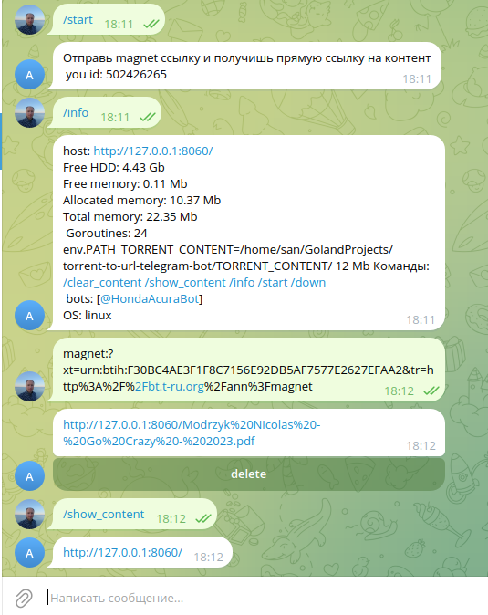

# torrent-to-url-telegram-bot
Tелегрмам чат бот для конвертации magnet ссылки в обычную ссылку

[Github](https://github.com/san035/torrent-to-url-telegram-bot)

## screenshot


## .env
```
# required parameters

# LIST_BOT_TOKEN split ','
LIST_BOT_TOKEN=
PORT=8060

# optional parameters

#default "bot answer url to torrent content"
BOT_ABOUT=

# default http://127.0.0.1
HOST= 

# default `TORRENT_CONTENT/`
PATH_TORRENT_CONTENT= 

# list id telegrem separat by "," 
# all admins must be first in list LIST_BOT_TOKEN
LIST_ADMIN_ID_TELEGRAM=

TYPE_ANSWER= # file or url, default file

# тип торрент клиента MOCK или ANACROLIX, для windows только MOCK
TORRENT_CLIENT=MOCK
```

## build
```
git clone git@github.com:san035/torrent-to-url-telegram-bot.git
cd torrent-to-url-telegram-bot
# edit .env
up.sh
```
